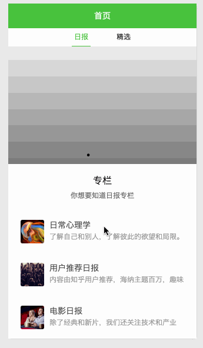
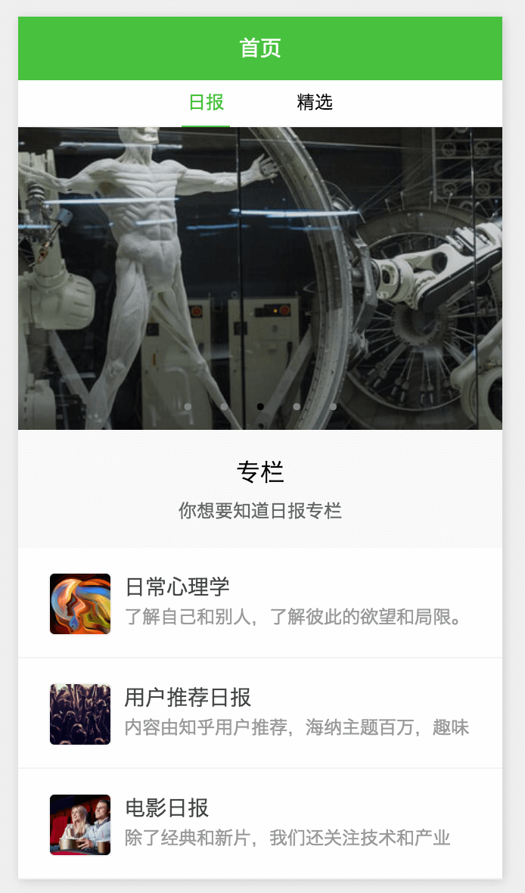
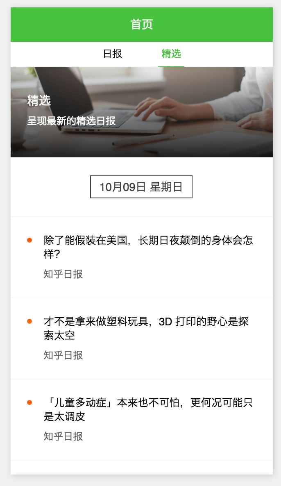
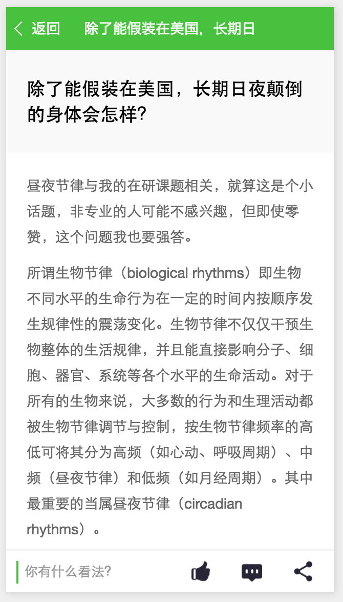
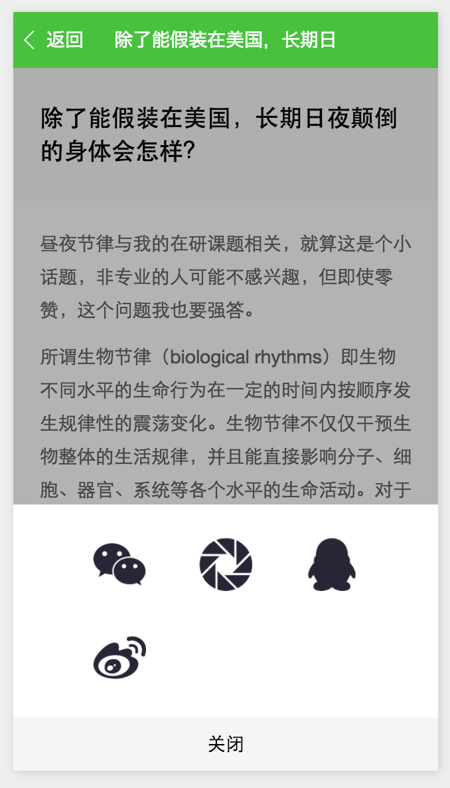
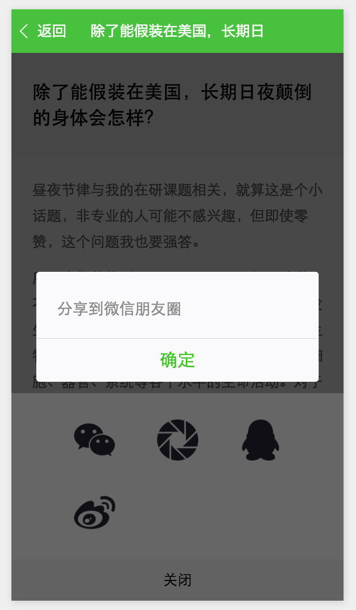
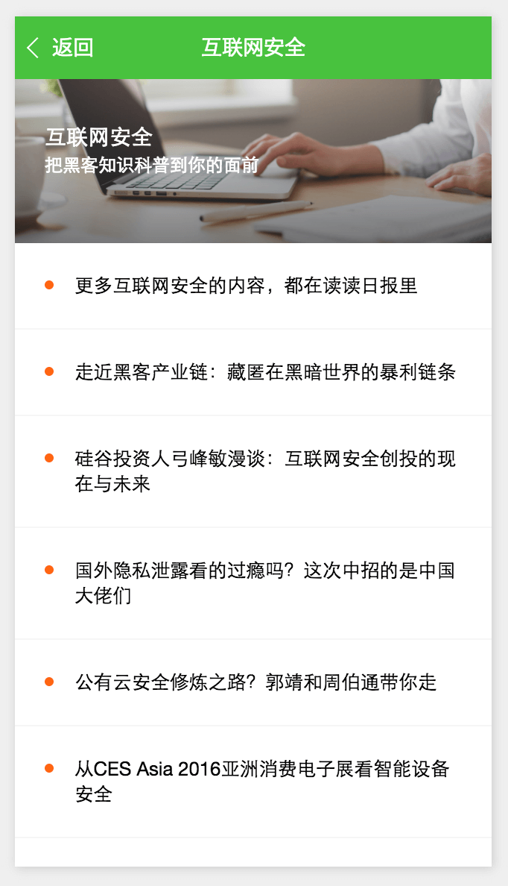

# 微信小程序示例应用 - 知乎日报

## 演示


## 目录结构
```
├── app.js
├── app.json
├── app.wxss
├── config.js
├── pages
│   ├── detail
│   ├── index
│   └── themes
├── static
│   ├── 001.jpg
│   ├── arrowright.png
│   ├── comments.png
│   ├── loading.gif
│   ├── loading.svg
│   ├── pengyou.png
│   ├── qq.png
│   ├── share.png
│   ├── wechat.png
│   ├── wechatHL.png
│   ├── weibo.png
│   ├── weixin.png
│   └── zan.png
├── template
│   └── itemlist.wxml
└── utils
    └── util.js
```

## 资源
[知乎日报 API 分析](https://github.com/izzyleung/ZhihuDailyPurify/wiki/知乎日报-API-分析)
[官方文档](https://mp.weixin.qq.com/debug/wxadoc/dev/?t=1475052055990)

## 说明
小程序刚刚出来不就就火爆了整个前端圈, 咱也不干落后的研究了一下, 网上找了个”知乎日报API接口“做了个小项目练手, 基本上还算完整的实现了整个项目, 欢迎 star.

由于小程序对HTML的不支持, 详情页做了些**简单的过滤**, 基本上看着还行。
某些网络图片无法显示. 貌似是小程序的BUG。

由于小程序的局限性, 很多效果还是无法实现的. 不知道公测是否会开放(！@#￥%……&*（）... 呵呵)


## 截图








